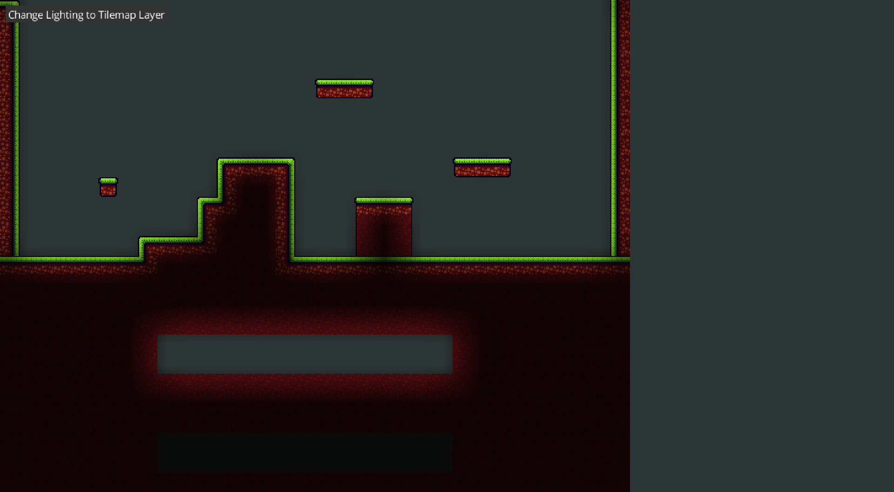
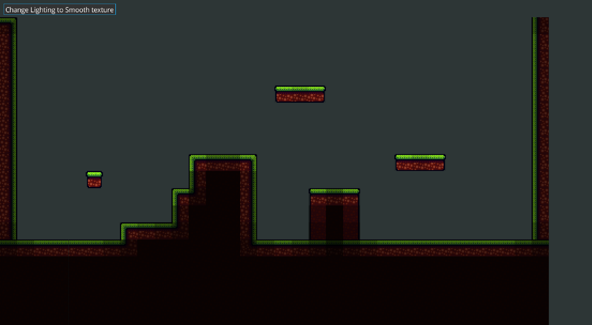

Libgdx lighting example via two different modes:

1. Via tiles in a tilemap to create hard shading
2. Via a small framebuffer (-> texture) which uses blending to create smooth shading

### Html Example: https://lyze237-examples.github.io/LibgdxTiledLightingExample/

Left click to destroy tiles.  
Right click to add tiles

This example is based on:
https://gamedev.stackexchange.com/questions/126078/how-can-i-implement-smooth-tile-based-lighting

Assets used: https://opengameart.org/content/dirt-tiles

## Smooth

## Tilemap

